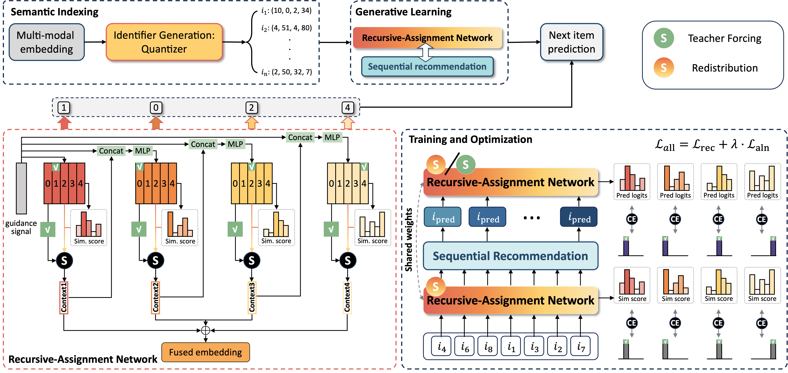
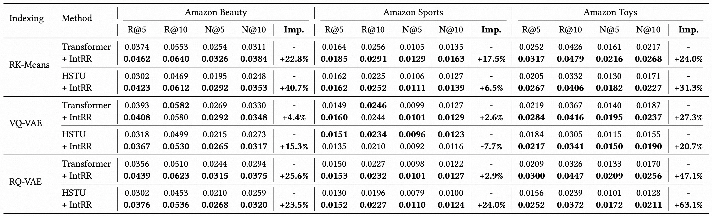
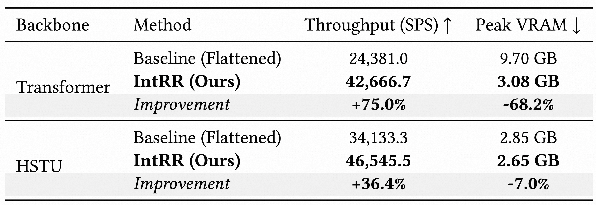
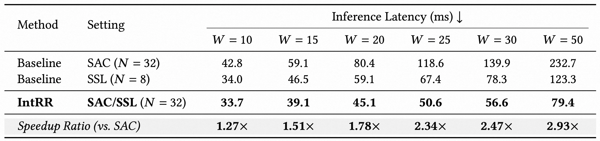
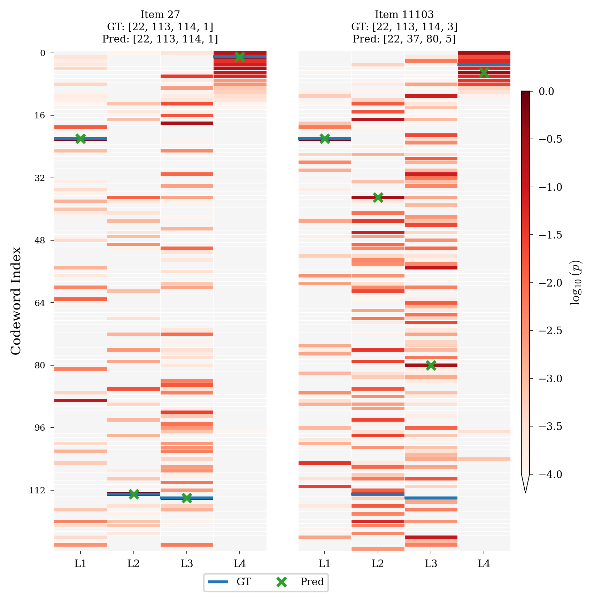

# IntRR: A Framework for Integrating SID Redistribution and Length Reduction

<div align="center">
Zesheng Wang¹, Longfei Xu¹†, Weidong Deng, Huimin Yan, Kaikui Liu, Xiangxiang Chu

<br>
<br>
AMAP, Alibaba Group

<br>

¹Equal contribution. &nbsp;&nbsp;&nbsp; &nbsp;&nbsp;&nbsp; †Corresponding author and project lead.

[](https://arxiv.org/abs/2602.20704)

</div>

## 📖 Overview
We introduce **IntRR**, a novel generative recommendation (GR) framework designed to break the **representation ceiling** and **computational bottlenecks** of current Semantic ID (SID)-based systems. Within a two-stage paradigm (Semantic Indexing &Generative Learning), IntRR optimizes Stage 2 by internalizing the hierarchical and flattened SIDs into the backbone, achieving deep collaborative-semantic integration while maintaining a constant one-token-per-item complexity.

## 💡 IntRR: Core Framework

<p align="center">
   
</p>


The core of IntRR is the **Recursive-Assignment Network (RAN)**, which functions as a differentiable bridge between collaborative signals and semantic structures through two key mechanisms:

*   **Adaptive SID Redistribution**: Utilizes item's Unique IDs (UIDs) as collaborative signals to dynamically refine semantic weights. This mechanism aligns content-based identifiers from Stage 1 with recommendation goals, breaking the "static ceiling" of traditional SIDs.
*   **Structural Length Reduction**: Internalizes the item's hierarchical navigation of SIDs within a recursive path. It reduces backbone's sequence length to a single token per item, eliminating multi-step inference bottleneck and significantly enhancing system throughput.


## 📊 Performance & Efficiency

IntRR yields substantial improvements in both recommendation accuracy and system scalability across multiple benchmarks.

### 1. Recommendation Accuracy
Overall performance comparison across diverse indexing methods (**RK-Means, VQ-VAE, RQ-VAE**) and backbones (**Transformer, HSTU**). IntRR consistently achieves superior recommendation accuracy and outperforms representative generative baselines.

<p align="center">
 
</p>

### 2. Efficiency & Complexity
Efficiency comparison in terms of training throughput, memory consumption, and inference latency. By bypassing SID flattening and the multi-pass inference bottleneck, IntRR delivers significant gains in system scalability.

<p align="center">
   
</p>
<p align="center">
  
</p>

## ✨ Visualizing SID Redistribution
Our analysis demonstrates that RAN adaptively steers item representations. Even for items sharing identical initial SIDs, IntRR triggers **semantic weight redistribution** based on collaborative interaction patterns, yielding more refined and unique item embeddings.

<p align="center">
  
</p>

## 📂 Repository Structure
```text
IntRR/
├── configs/                 # Configuration files
│   ├── callbacks/          # PyTorch Lightning callbacks
│   ├── experiment/         # Experiment configurations (training/inference)
│   ├── extras/             # Extra configurations
│   ├── logger/             # Logging configurations
│   ├── paths/              # Path configurations
│   └── trainer/            # Trainer configurations
├── refs/                   # Reference images and figures
├── src/                    # Source code
│   ├── components/         # Core components
│   │   ├── clustering_initializers.py
│   │   ├── distance_functions.py
│   │   ├── eval_metrics.py
│   │   ├── loss_functions.py
│   │   ├── optimizer.py
│   │   ├── quantization_strategies.py
│   │   ├── scheduler.py
│   │   └── training_loop_functions.py
│   ├── models/             # Model implementations
│   │   ├── components/     # Model components
│   │   └── modules/        # Model modules
│   ├── modules/            # Neural network modules
│   │   └── clustering/     # Clustering algorithms
│   └── utils/              # Utility functions
├── gen_sid.sh              # Script to generate Semantic IDs
├── run_intrr.sh            # Script to run IntRR training
├── run_tiger.sh            # Script to run TIGER baseline
├── requirements.txt        # Python dependencies
└── README.md               # This file
```
## 📦 Installation

  

### Prerequisites

- Python 3.10+

- CUDA-compatible GPU (recommended)

  

## 🎯 Quick Start

  

### Prerequisites

  

For environment setup and data preparation, please refer to the [GRID (Generative Recommendation with Semantic IDs)  repository](https://github.com/snap-research/GRID).

  

### 1. Generate Semantic IDs

  

Generate Semantic IDs and Update `dataset_config.sh`

  

```bash

sh  gen_sid.sh  --datasets  sports  --sid-methods  rkmeans

```

  

### 2. Train IntRR with Semantic IDs

  

Train the recommendation model using the learned semantic IDs:

  

```bash

sh  run_intrr.sh  --datasets  sports  --seeds  42  --sid-type  rkmeans

```

## 🙏 Acknowledgments

This work builds upon the [GRID](https://github.com/snap-research/GRID) framework by Snap Research. We thank the GRID team for their open-source contributions to the generative recommendation community, which provides a solid foundation for SID-based generative recommendation research.

## 📚 Citation

If you find our paper and code helpful for your research, please consider starring our repository ⭐ and citing our work ✏️.

```bibtex
@article{wang2026intrr,
  title={IntRR: A Framework for Integrating SID Redistribution and Length Reduction},
  author={Wang, Zesheng and Xu, Longfei and Deng, Weidong and Yan, Huimin and Liu, Kaikui and Chu, Xiangxiang},
  journal={arXiv preprint arXiv:2602.20704},
  year={2026}
}